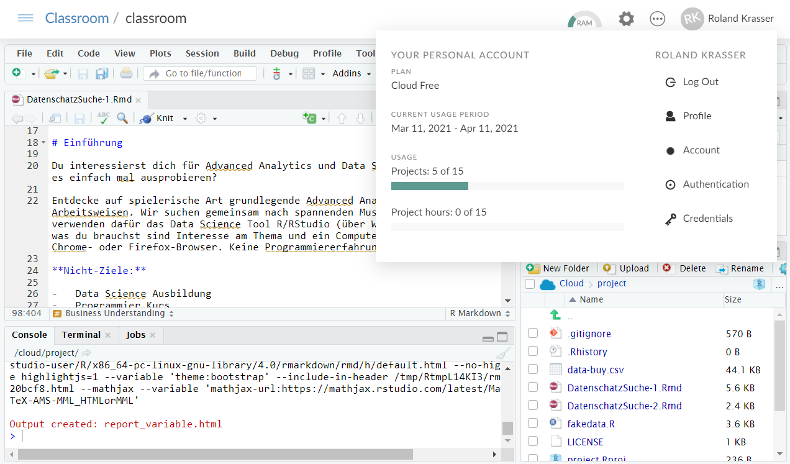
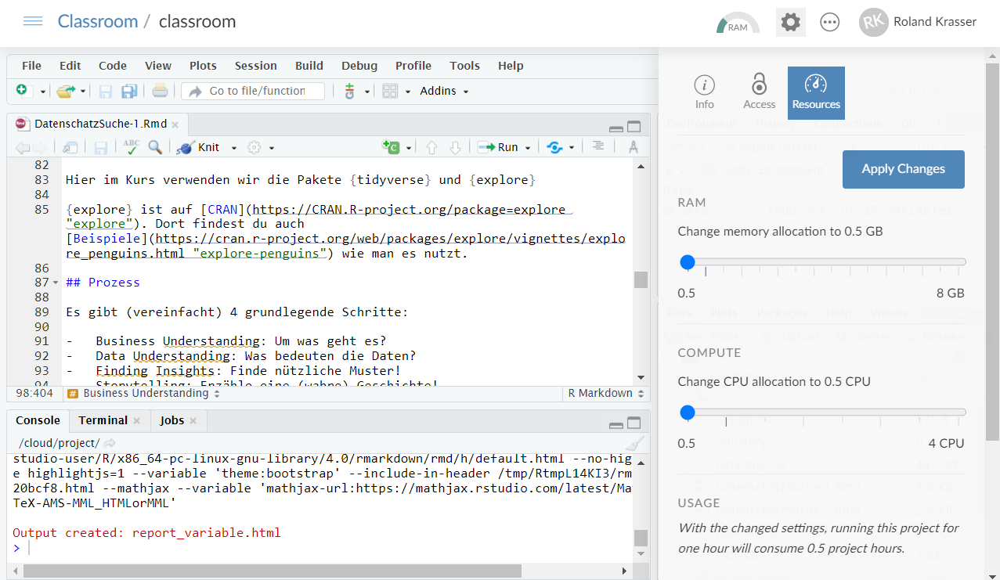

```{r setup, include=FALSE}
knitr::opts_chunk$set(echo = TRUE, message = FALSE, warning = FALSE)
```

# Geschafft!

{width="800"}

**Du hast die Datenschatz-Suche gemeistert! Wie könnte es weiter gehen?**

# Weiter üben

## RStudio.cloud

Du kannst RStudio.cloud weiter kostenlos verwenden und die Datenschatz-Suche in Ruhe noch einmal machen. Allerdings ist die kostenlose Rechenzeit in RStudio.cloud mit 15 "Project Hours" pro Monat begrenzt.

Du kannst die "Project Hours" abrufen, indem du in rstudio.cloud rechts oben auf deinen User-Namen clickst.

{width="800"}

Um Rechenzeit zu sparen, kannst du auch den Speicher-Verbrauch und die Anzahl der CPUs reduzieren. Dazu musst du in ein Projekt gehen (z.B. classroom, das wir für die Schatzsuche verwendet haben) und oben auf das Zahnrad-Symbol clicken. Dort kannst du RAM und Compute auf 0.5 reduzieren, dann kannst du RStudio doppelt so lange pro Monat kostenlos nutzen.

{width="800"}

Mit diesen Einstellungen kannst du allerdings keine großen Datensätze bearbeiten.

**Bitte beachte auch, dass du RStudio.cloud NICHT zur Analyse von echten Business-Daten verwenden darfst (Datenschutz!)**

## Lokales R/RStudio

Du kannst RStudio auch lokal installieren und nutzen. Lasse dir dafür über den EDV Webshop folgende Programme installieren (kostenlos)

-   R for Windows 4.0.2 (oder höher)
-   RStudio 1.3.959 (oder höher)

Alternativ kannst du diese Programme auch selbst lokal installieren (auch ohne Admin-Rechte):

1.  Download R von <https://cran.r-project.org/bin/windows/base/>
2.  Starte das Installationsprogramm von R
3.  Du brauchst keine Einträge im Windows Startmenü
4.  Gehe zu <https://rstudio.com/products/rstudio/download/>
5.  Wenn Admin-Rechte am lokalen Computer: Download Installer
6.  Wenn keine Admin-Rechte am lokalen Computer: Download ZIP/Tarballs
7.  Start RStudio. Wenn kein RStudio im Windows-Startmenü starte es erstmals händisch (bin/rstudio.exe) und "pinne" es dann an die Startleiste.

# Weiter lernen

## Neue Datenschatz-Suche

Hier ein paar Empfehlungen, die auf der "Datenschatz-Suche" aufbauen:

-   Erforsche Pinguine!\
    <https://cran.r-project.org/web/packages/explore/vignettes/explore_penguins.html>

-   Erforsche Autos aus den 70ern\
    <https://cran.r-project.org/web/packages/explore/vignettes/explore_mtcars.html>

-   Lasse Entscheidungsbäume wachsen!\
    <https://rolkra.github.io/lets-grow-trees/>

-   Analysiere den Titanic Untergang!\
    <https://cran.r-project.org/web/packages/explore/vignettes/explore_titanic.html>

## R Coding Lernen

Wenn du das Programmieren in R lernen möchtest hier ein paar Empfehlungen:

-   RStudio Primers\
    <https://rstudio.cloud/learn/primers>

-   R for Data Science\
    <https://r4ds.had.co.nz/index.html>

-   Tidy Tuesday Live Coding (Advanced)\
    <https://www.youtube.com/user/safe4democracy/videos>

## Eigene Daten analysieren

- Importiere Daten mit `File` > `Import Dataset...`
- Und suche nach einem "Datenschatz"
- Tipp: verwende nicht zu große Daten. Verwende Text-, CSV- oder Excel Dateien wo die einzelnen Beobachtungen (z.B. Kunden) in den Zeilen stehen und Eigenschaften (z.B. Alter, Geschlecht) in den Spalten

## Mehr Statistik 

-   Stecke 50 Personen in einen Bus und schau was passiert!\
    <https://rolkra.github.io/never-trust-an-average/>
    
-   Target vs Control-Group (Shiny App)\
    <https://github.com/rolkra/cgtg>

-   Statistical Inference (Advanced)\
    <https://moderndive.com/>

-   Statistik mit R (Advanced)\
    <https://bookdown.org/speegled/foundations-of-statistics/>
