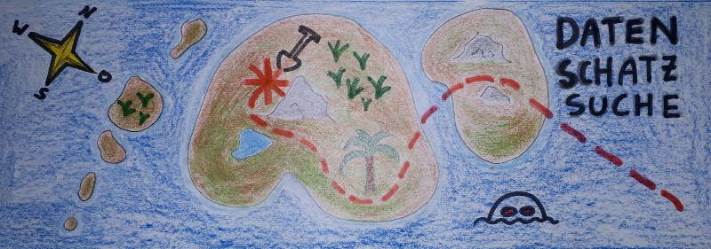

```{r setup, include=FALSE}
# rmarkdown settings
knitr::opts_chunk$set(echo = TRUE, message = FALSE, warning = FALSE)

# packages
library(tidyverse)
library(explore)
library(tidydice)

# user defined function
add_line <- function(
  plot, x = 0, color = "red", size = 1, alpha = 0.75)  {
  plot + geom_vline(
    xintercept = x, color = color, alpha = alpha, size = size)
}
```

# Einführung

{width="800"}

**Du interessierst dich für Advanced Analytics und Data Science und möchtest es einfach mal ausprobieren?**

Entdecke auf spielerische Art grundlegende Advanced Analytics Konzepte und Arbeitsweisen. Wir suchen gemeinsam nach spannenden Mustern in Daten und verwenden dafür das Data Science Tool R/RStudio (über Webbrowser). Alles was du brauchst sind Interesse am Thema und ein Computer mit Teams und Chrome- oder Firefox-Browser. Keine Programmiererfahrung notwendig.

**Nicht-Ziele:**

-   Data Science Ausbildung
-   Programmier Kurs
-   Data Science Tools Einschulung
-   Fachbegriffe lernen
-   Frontalvortrag

**Ziele:**

-   Gemeinsames spielerisches Erarbeiten
-   Was "tut" man (und wie "denkt" man) als "Data Scientist"

## Rstudio.cloud

RStudio ist ein Datascience Tool das entweder lokal, oder über Webzugang (Cloud) verwendet werden kann.

-   Links oben = Code Editor
-   Links unten = Console (Ausgabe von Text)
-   Rechts oben = Anzeige von Daten und Variablen
-   Rechts unten = Anzeige von Files und Plots

Wir arbeiten hauptsächlich im Code Editor!

## Notebooks

Notebooks sind ein typisches Data Science Werkzeug. Sie enthalten Code, das Ergebnis von Code (z.B. Grafiken) und Text/Dokumentation in einem einzigen Dokument. Vorteil: alles ist an einem Ort, und alle Schritte sind nachvollziehbar (reproducible data science)

Du kannst Text und Code direkt ändern.

```{r}
print("Auf geht's zur Datenschatz Suche!")
```

Den Code kann du ausführen, indem du in den Text klickst und danach auf den grünen "Play Button" klickst. Achte auf die Reihenfolge.

[Jetzt Du! ...]

Du kannst den Code auch einfach "kopieren" (kopiere auch das "{r}" mit)

[Jetzt Du! ...]

## Funktionen

Einige Funktionen die wir verwenden:

+------------------+-------------------------------------+
| Funktion         | Bedeutung                           |
+==================+=====================================+
| `%>%`            | "und dann mache" - Operator\        |
|                  | `<strg> <shift> m`                  |
+------------------+-------------------------------------+
| `describe()`     | Beschreiben                         |
+------------------+-------------------------------------+
| `explore()`      | Grafisch erforschen                 |
+------------------+-------------------------------------+
| `add_line()`     | Eine Linie in Grafik einfügen       |
+------------------+-------------------------------------+
| `filter()`       | Filtern (welche Kunden behalten?)   |
+------------------+-------------------------------------+
| `explain_tree()` | Erkläre mit einem Entscheidungsbaum |
+------------------+-------------------------------------+

## Prozess

Es gibt (vereinfacht) 4 grundlegende Schritte:

-   **Business Understanding**: Um was geht es?
-   **Data Understanding**: Was bedeuten die Daten?
-   **Finding Insights**: Finde nützliche Muster (und hinterfrage sie)!
-   **Storytelling**: Erzähle eine (wahre) Geschichte!

# Business Understanding

Es wurde ein neues Produkt entwickelt, und das Kaufinteresse an 1000 Personen getestet. Du bekommst nun die Daten und sollst herausfinden, für wen das Produkt besonders gut geeignet ist.

Von deiner Analyse hängt es ab ob das Produkt auf den Markt kommt und wie es beworben wird.

# Data Understanding

Die Daten sind als `data` abgespeichert. Die Variable `buy` enthält die Info, ob der Kunde ein Kaufinteresse hat (buy == 1) oder nicht (buy == 0).

```{r message=FALSE}
data <- read_csv("data-buy.csv") %>% select(-event_web)
```

## buy

Wir machen uns zuerst einen Überblick über die Variable `buy`

```{r}
data %>% describe(buy)
```

Wie viele Kunden haben das Produkt gekauft?

[Jetzt Du! ...]

## age

Danach schauen wir uns die Variable `age` an:

Welche Altersverteilung wäre zu erwarten? Was wäre plausibel?

```{r}
data %>% describe(age)
```

Was sagt uns das Ergebnis?

[Jetzt Du! ...]

Einen besseren Überblick bekommen wir, wenn wir uns das Alter grafisch ausgeben:

```{r fig.height=2.5}
data %>% explore(age)
```

Was sagt uns das Ergebnis?

[Jetzt Du! ...]

Wir können den Mittelwert mit einer Linie einzeichnen:

```{r fig.height=2.5}
data %>% explore(age) %>% add_line(52)
```

## [Variable ...]

[Jetzt Du! ...]

# Finding Insights

## age

```{r fig.height=2.5}
data %>% explore(age, target = buy)
```

Welchen Zusammenhang gibt es zwischen Alter und Kaufverhalten?

[Jetzt Du! ...]

## [Variable ...]

[Jetzt Du! ...]

## Multivariat

Wir haben etliche Muster gefunden. Aber welche sind besonders wichtig, und wie hängen sie zusammen?

Ein Entscheidungsbaum (Decision Tree) kann uns die Zusammenhänge erklären:

```{r}
data %>% explain_tree(target = buy)
```

## Machine Learning

Der Decision Tree Algorithmus "lernt" welche Kunden eher kaufen. Nun können wir ein Modell erstellen und eine Vorhersage machen:

```{r include=FALSE}
model <- data %>%
  select(age, female_ind, bbi_usg_gb, buy) %>% 
  explain_tree(target = buy, out = "model")
```

```{r}
predict(
  model, 
  tibble(age = 40, female_ind = 0, bbi_usg_gb = 10)
)
```

Wir erhalten die vorhergesagten Wahrscheinlichkeiten für Nicht-Kauf und Kauf (buy)

# Story Telling

Welchen Kunden soll das Produkt angeboten werden und warum? Erzähle eine "Geschichte", die alle wesentlichen Insights enthält, aber trotzdem für einen Data Science Laien einfach, verständlich und nachvollziehbar ist!

[Jetzt Du! ...]
