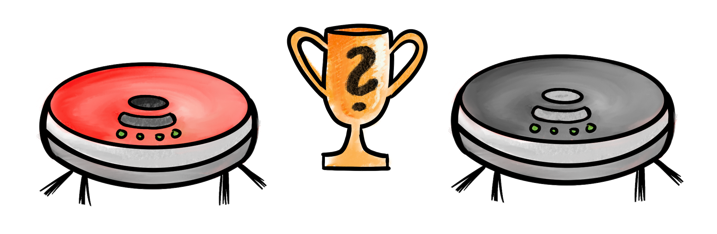
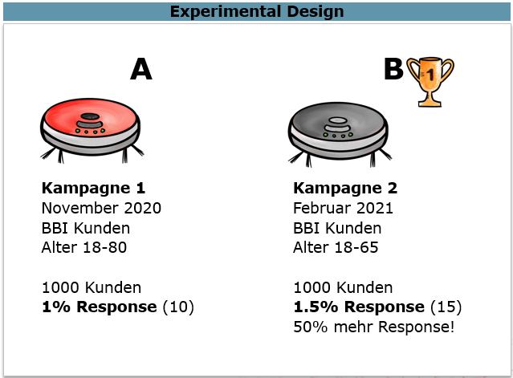

```{r setup, include=FALSE}
# rmarkdown settings
knitr::opts_chunk$set(echo = TRUE, message = FALSE, warning = FALSE)

# packages
library(tidyverse)
library(explore)
library(tidydice)

# user defined function
add_line <- function(
  plot, x = 0, color = "red", size = 1, alpha = 0.75)  {
  plot + geom_vline(
    xintercept = x, color = color, alpha = alpha, size = size)
}
```

# Einführung

{width="800"}

**Analyse-Ergebnisse optimal für datengetriebene Entscheidungen nutzen!**

Lerne "Daten Driven Decision Making" in der Praxis kennen und entdecke auf spielerische Art grundlegende Konzepte der Statistik und Wahrscheinlichkeitsrechnung (z.B statistische Signifikanz) ganz ohne mathematische Formeln. Wir führen gemeinsam statistische Experimente durch und verwenden dafür das Data Science Tool R/RStudio (über Webbrowser). Alles was du brauchst sind Interesse am Thema und ein Computer mit Teams und Chrome- oder Firefox-Browser. Keine Statistik und Mathematik Vorkenntnisse notwendig.

**Nicht-Ziele:**

-   Statistik Ausbildung
-   Mathematische Formeln
-   Fachbegriffe lernen
-   Frontalvortrag

**Ziele**

-   Gemeinsames spielerisches Erarbeiten
-   Was muss man als (data driven) "Entscheider" beachten
-   Interpretations-"Fallen" erkennen

## Echtes Gold?

Wir haben bereits einige interessante Muster in den Daten gefunden. Aber ist es ein echter Datenschatz mit Goldmünzen, oder enthält der Schatz doch nur "Plastik-Münzen"?

Und was machen wir mit dem Datenschatz? Verwenden wir ihn für etwas sinnvolles, das uns im Business weiter bringt, oder wird er einfach wieder "vergraben"?

Meist werden Entscheidungen nicht vom Data Scientist selbst getroffen, sondern von einem "Decision Maker", der datengetrieben agieren sollte.

Nicht immer funktioniert das:

{width="350"}

## Datengetrieben

Für eine gute Datengetriebene Entscheidungen braucht man:

-   Klare Fragestellung
-   Gute Daten
-   Plausible Muster (Insights)
-   Sinnvolle Schlussfolgerungen

{width="800"}

## Häufigste "Fallen"

### Wien oder Fürstenfeld?

In welcher Stadt (Wien oder Fürstenfeld) ist die Corona-Gefahr geringer?

In Wien gibt es 100 Corona Fälle, in Fürstenfeld nur 50, daher lieber nach Fürstenfeld fahren!

Datenquelle: Sozialministerium (Corona-Fälle pro Stadt)

{width="400"}

[Jetzt Du! ...]

```{r}
corona <- data.frame(
  city = c("Wien", "Fürstenfeld"),
  cases = c(100, 50),
  pop_100k = c(19, 0.6)
)
corona
```

```{r}
corona %>% 
  mutate(risk = cases * 1)  # how to calculate risk properly?
```

### Prepaid-Umsatz

Wie viel Umsatz hat ein typischer Prepaid-Kunde?

Ein typischer Prepaid Kunde hat 11 EUR.

Datenquelle: 100 Referenzkunden Prepaid (99 Kunden mit ca 1 EUR, und 1 Kunde mit 1000 EUR)

{width="400"}

[Jetzt Du! ...]

```{r}
umsatz <- c(rep(1, 99), 1000)
umsatz %>% mean() %>% round()
```

### Mehr Gehalt

Wie bekommt man mehr Gehalt?

Eine Studie besagt: Personen mit Glatze verdienen mehr Geld. Rasiere dir eine Glatze, dann bekommst du auch mehr Geld!

{width="400"}

[Jetzt Du! ...]

### Cola Light oder Zero?

Schmecken Cola Light und Cola Zero unterschiedlich?

Experiment: Blind Verkostung Cola Light vs Cola Zero mit einer Testperson. Bei 6 von 10 Fällen richtig gelegen! Beweis, dass Unterschied erkannt wird, weil mehr als die Hälfte richtig!

{width="400"}

[Jetzt Du! ...]

```{r}
flip_coin(times = 10, agg = TRUE)
```

```{r}
flip_coin(times = 10, rounds = 10000, agg = TRUE) %>% 
  explore_bar(success, num = FALSE)
```

### Zusammenfassung

{width="600"}

{width="600"}

Wenn du diese Fallen erkennst, dann hast du bereits einen tollen "Data Driven Bullshit"-Detektor!

-   **Falscher Bezug**:\
    In Wien gibt es 100 Corona Fälle, in Fürstenfeld nur 50, daher lieber nach Fürstenfeld fahren!

-   **Verzerrte Mittelwerte**:\
    100 Kunden haben je ca 1 EUR Umsatz, 1 Kunde hat 1000 EUR (Mittelwert 11 EUR). Ein typischer Kunde diese Kundengruppe hat also ca 11 EUR Umsatz!

-   **Äpfel mit Birnen vergleichen**:\
    Gehalt von Personen mit und ohne Glatze (Du vergleichst eigentlich "alte Männer" mit "Jungen Frauen")

-   **Korrelation mit Kausalität verwechseln**:\
    Personen mit Glatze verdienen mehr Geld. Rasiere dir eine Glatze, dann bekommst du auch mehr Geld!

-   **Statistische Signifikanz vergessen**:\
    Blind Verkostung Cola Light vs Cola Zero: bei 6 von 10 Fällen richtig! Beweis, dass Unterschied erkannt wird, weil mehr als die Hälfte richtig!

# Favoriten am Semmering!

Während einer Corona Welle sind zu Spitzenzeiten mehr als 4.700 Personen am Semmering.

Die Mubilfunk-Bewegungsdaten von Invenium zeigen: "Die meisten Gäste kamen aus Favoriten". Das zeigt, dass sich Menschen in Favoriten besonders schlecht an staatliche Vorgaben halten!

{width="400"}

Kurier Artikel: <https://kurier.at/chronik/oesterreich/semmering-chaos-mobilfunk-daten-zeigen-spitzenzeiten-mit-mehr-als-4000-besuchern/401147658>

[Jetzt Du! ...]

# Data Driven Lotto

Mit Statistik im Lotto erfolgreich sein!

Durch eine genaue Analyse welche Zahlen an welchen Tagen im österreichischen Lotto gezogen wurden, können die Gewinnchancen massiv erhöht werden:

{width="600"}

An einem 31. gab es laut Kronenzeitung bereits 56 Ziehungen. Im Schnitt kam jede Zahl 8 mal. Die Zahl 38 kam jedoch 14 mal. Daher unbedingt bei der nächsten Ziehung am 31. auf die Zahl 38 setzen!

[Jetzt Du! ...]

# Staubsauger Werbung

{width="400"}

**Fragestellung**:

Welche Zielgruppe soll der Werbespot für den Staubsauger ansprechen?

**Vorgehen**:

Es wurden zunächst das Produkt im Shop ausprobiert. Danach wurden die Daten von 1000 Kunden, die bei einer Testkampagne teilgenommen haben, auf bzgl. Datenqualität überprüft und danach ausgewertet. Zu jedem Kunden wurden 14 Variablen erfasst (neben Alter, Geschlecht, Wohnort, Produktnutzung etc. auch das Kaufverhalten). Es wurde für die Muster-Suche der Machine Learing Algorithmus "Decision Tree" angewendet.

**Ergebnis**:

Besonders interessant ist der Staubsauger für jüngere Frauen (unter 52 Jahre), die Internet-Affin sind (Internet-Usage \> 61 GB). Besonders uninteressant ist das Produkt für Kunden ab 52 Jahre.

[Jetzt Du! ...]

# Staubsauger Farbe!

In Datenschatz Suche - Teil 1 wurde ein Produkt ca. von jedem 6. Kunden gekauft - das entspricht der gleichen Wahrscheinlichkeit, wie bei einem Würfel eine 6 zu würfeln (1/6 = 16,7%).

Nun hat die Produktentwicklung eine Änderung am Produkt vorgenommen, es ist nun ganz grau statt rot. Das graue Produkt haben 14 von 60 Test-Kunden gekauft (23,3%) - das ist eine um fast 40% höhere Take-Rate als vorher! Soll die Produktion jetzt umgestellt werden (Investitionskosten von 1 Mio EUR)

Investieren oder doch eine "Falle"?

[Jetzt Du! ...]

## Experimental Design

Um eine Frage optimal datengetrieben beantworten zu können, kann es notwendig sein, zuerst die "passenden" Daten dafür im Rahmen eines "Experimentes" zu generieren.

Beispiel: Ist der Rote oder der Graue Staubsauger bei den Kunden beliebter?

{width="500"}

Wenn keine Verkaufszahlen nach Farbe vorliegen, müssen wir erst Daten im Rahmen eines Experimentes generieren.

{width="500"}

Ist dieses "Experimental Design" sinnvoll?

Wird im November 2020 nur der Graue Staubsauger verkauft, und im Februar 2021 nur der Rote Staubsauger, wie soll man unterschiedliche Verkaufszahlen interpretieren? Wurden mehr Rote Staubsauger verkauft, weil sich "Rot" besser verkauft? Oder weil im Februar 2021 die Corona-Beschränkungen weiter gelockert wurden und mehr Leute in die Shops gegangen sind?

Mit so einem "Experimental-Design" ist es unmöglich, eine klare Schlussfolgerung zu ziehen!

Daher: bereits bei der Planung des "Experiments" sollte klar sein, welche Schlussfolgerungen man ableiten möchte. Durch das Design des Experiments werden die genötigten Daten generiert, die diese Schlussfolgerungen ermöglichen.

{width="500"}

Optimales "Expermental-Design": z.B. Kunden im Rahmen einer Kampagne zufällig in die Gruppen "Grau" und "Rot" einteilen, und den jeweiligen Staubsauger anbieten. Die Kundengruppen müssen groß genug sein, dass sie am Ende der Kampagne eine statistisch signifikante Aussage zulassen.

## Statistische Signifikanz

Designe dir deinen eigenen Würfel:

```{r}
dice <- roll_dice(times = 6, rounds = 10) 
sechser <- sum(dice$success)
dice %>% 
  plot_dice(fill = "coral", fill_success = "red", point_color = "white") + 
  ggtitle(paste(sechser, "x Sechs"))
```

[Jetzt Du! ...]

Wenn du 60 mal würfelst, wie oft kommt eine 6?

```{r fig.height=2.5}
roll_dice(times = 60, rounds = 1000, agg = TRUE) %>% explore(success)
```

Zeichne den "Erwartungswert" ein (was ist der wahrscheinlichste Wert)

[Jetzt Du! ...]

```{r fig.width=6, fig.height=2.5}
roll_dice(times = 60, rounds = 1000, agg = TRUE) %>% 
  explore_bar(success) %>% 
  add_line(1)  # change to correct value
```

Wie wahrscheinliche ist es, dass man bei 60 mal würfeln 14 Sechser bekommst? Zufall oder ein "gezinkter Würfel"?

[Jetzt Du! ...]

## Binomialverteilung

Im Statistik Buch steht, dass du bei Würfel Experimenten die Wahrscheinlichkeiten mit einer sogenannten "Binomialverteilung" berechnen kannst.

Wahrscheinlichkeit zufällig \>= 14 mal eine 6 zu würfeln

```{r}
binom(60, 1/6) %>% plot_binom(highlight = 14:30)
```

# Export als HTML

Wir können nun das gesamte Notebook als HTML-Dokument exportieren. Drücke dafür den "Knit-it"-Button (Englisch für "Stricken") am oberen Rand.

Es wird das HTML-Dokument automatisch generiert und angezeigt. Du findest das Dokument dann auch im Files-Fenster (rechts unten)

Um es zu exportieren klicke das "Kästchen" an und wähle "More" \> "Export..."

[Jetzt Du! ...]
