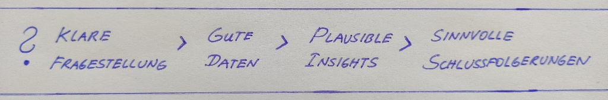

```{r setup, include=FALSE}
# rmarkdown settings
knitr::opts_chunk$set(echo = TRUE, message = FALSE, warning = FALSE)

# packages
library(tidyverse)
library(explore)
library(tidydice)

# user defined function
add_line <- function(
  plot, x = 0, color = "red", size = 1, alpha = 0.75)  {
  plot + geom_vline(
    xintercept = x, color = color, alpha = alpha, size = size)
}
```

# Einführung

{width="800"}

**Analyse-Ergebnisse optimal für datengetriebene Entscheidungen nutzen!**

Lerne "Daten Driven Decision Making" in der Praxis kennen und entdecke auf spielerische Art grundlegende Konzepte der Statistik und Wahrscheinlichkeitsrechnung (z.B statistische Signifikanz) ganz ohne mathematische Formeln. Wir führen gemeinsam statistische Experimente durch und verwenden dafür das Data Science Tool R/RStudio (über Webbrowser). Alles was du brauchst sind Interesse am Thema und ein Computer mit Teams und Chrome- oder Firefox-Browser. Keine Statistik und Mathematik Vorkenntnisse notwendig.

**Nicht-Ziele:**

-   Statistik Ausbildung
-   Mathematische Formeln
-   Fachbegriffe lernen
-   Frontalvortrag

**Ziele**

-   Gemeinsames spielerisches Erarbeiten
-   Was muss man als (data driven) "Entscheider" beachten
-   Interpretations-"Fallen" erkennen

## Echtes Gold?

Wir haben bereits einige interessante Muster in den Daten gefunden. Aber ist es ein echter Datenschatz mit Goldmünzen, oder enthält der Schatz doch nur "Plastik-Münzen"?

Meist werden datengetriebene Entscheidungen nicht vom Data Scientist selbst getroffen, sondern von einem "Decision Maker", der die "Story" und die Schlussfolgerungen kritisch hinterfragen muss.

Nicht immer funktioniert das:

{width="350"}

Für eine gute Datengetriebene Entscheidungen braucht man:

- Klare Fragestellung
- Gute Daten
- Plausible Muster (Insights)
- Sinnvolle Schlussfolgerungen

{width="800"}

## Häufigste "Fallen"

### Wien oder Fürstenfeld?

In welcher Stadt (Wien oder Fürstenfeld) ist die Corona-Gefahr geringer?

In Wien gibt es 100 Corona Fälle, in Fürstenfeld nur 50, daher lieber nach Fürstenfeld fahren! 

Datenquelle: Sozialministerium (Corona-Fälle pro Stadt)

{width="800"}
[Jetzt Du! ...]

```{r}
corona <- data.frame(
  city = c("Wien", "Fürstenfeld"),
  cases = c(100, 50),
  pop_100k = c(19, 0.6)
)
corona
```


### Prepaid-Umsatz

Wie viel Umsatz hat ein typischer Prepaid-Kunde?

Ein typischer Prepaid Kunde hat 11 EUR.

Datenquelle: 100 Referenzkunden Prepaid (99 Kunden mit ca 1 EUR, und 1 Kunde mit 1000 EUR)

{width="800"}
[Jetzt Du! ...]

```{r}
umsatz <- c(rep(1, 99), 1000)
umsatz %>% mean() %>% round()
```

### Cola Light oder Zero?

Schmecken Cola Light und Cola Zero unterschiedlich?

Experiment: Blind Verkostung Cola Light vs Cola Zero mit einer Testperson. Bei 6 von 10 Fällen richtig gelegen! Beweis, dass Unterschied erkannt wird, weil mehr als die Hälfte richtig!

{width="800"}
[Jetzt Du! ...]

```{r}
flip_coin(times = 10, agg = TRUE)
```

```{r}
flip_coin(times = 10, rounds = 10000, agg = TRUE) %>% 
  explore_bar(success, num = FALSE)
```

### Mehr Gehalt

Wie bekommt man mehr Gehalt?

Personen mit Glatze verdienen mehr Geld. Rasiere dir eine Glatze, dann bekommst du auch mehr Geld!

{width="800"}
[Jetzt Du! ...]

### Zusammenfassung

Diese 4 Fallen kommen besonders häufig vor:

-   **Falscher Bezug**:\
    In Wien gibt es 100 Corona Fälle, in Fürstenfeld nur 50, daher lieber nach Fürstenfeld fahren!

-   **Mittelwerte mit Extremwerten**:\
    100 Kunden haben je ca 1 EUR Umsatz, 1 Kunde hat 1000 EUR (Mittelwert 11 EUR). Ein typischer Kunde diese Kundengruppe hat also ca 11 EUR Umsatz!

-   **Statistische Signifikanz vergessen**:\
    Blind Verkostung Cola Light vs Cola Zero: bei 6 von 10 Fällen richtig! Beweis, dass Unterschied erkannt wird, weil mehr als die Hälfte richtig!

-   **Korrelation mit Kausalität verwechseln**:\
    Personen mit Glatze verdienen mehr Geld. Rasiere dir eine Glatze, dann bekommst du auch mehr Geld!

# Datenschatz Suche 1

```{r message=FALSE}
data <- read_csv("data-buy.csv") %>% select(-event_web)
```

Was waren die Zusammenhänge, die wir gefunden haben? Was würdest du dem "Decision Maker" vorschlagen?

[Jetzt Du! ...]

## Geringe Internet Usage!

Eine Analyse aus der Produktentwicklung hat ergeben, dass folgende Kunden besonderes großes Kaufinteresse haben:

**Kunden mit geringer Internet Usage (bbi_usg_gb)**:

Die durchschnittliche bbi_usg_gb (Broad Band Internet Usage in Gigabyte) bei Kaufinteresse = 72, ohne Kaufinteresse = 174.

Passt das mit den Analyse-Ergebnissen aus unserer Datenschatz Suche 1 zusammen? Wenn nein, wer ist in welche Falle "getappt"?

Du kannst die Funktionen verwenden, die wir bereits kennen gelernt haben: `%>%`, `explore(eigenschaft)`, `explore(eigenschaft, target = buy)`, `describe(eigenschaft)`, `filter(buy == 1)`

[Jetzt Du! ...]

## Mobile Voice!

Eine Analyse aus der Produktentwicklung hat ergeben, dass folgende Kunden besonderes großes Kaufinteresse haben:

**Kunden mit MobileVoice**:

Bei Kunden mit MobileVoice gibt es 92 Käufer, bei Kunden ohne Mobile Voice sind es nur 66. Daher das Produkt nur Kunden mit MobileVoice anbieten, oder wenn noch nicht vorhanden als Kombi-Paket (MobileVoice + Produkt)

Passt das mit den Analyse-Ergebnissen aus unserer Datenschatz Suche 1 zusammen? Wenn nein, wer ist in welche Falle "getappt"?

Du kannst die Funktionen verwenden, die wir bereits kennen gelernt haben: `%>%`, `explore(eigenschaft)`, `explore(eigenschaft, target = buy)`, `describe(eigenschaft)`, `filter(buy == 1)`

[Jetzt Du! ...]

## Rote Farbe!

In Datenschatz Suche - Teil 1 wurde ein Produkt ca. von jedem 6. Kunden gekauft - das entspricht der gleichen Wahrscheinlichkeit, wie bei einem Würfel eine 6 zu würfeln (1/6 = 16,7%).

Nun hat die Produktentwicklung eine Änderung am Produkt vorgenommen, es ist nun ganz rot. Das rote Produkt haben 14 von 60 Test-Kunden gekauft (23,3%) - das ist eine um fast 40% höhere Take-Rate als vorher! Soll die Produktion jetzt umgestellt werden (Investitionskosten von 1 Mio EUR)

Investieren oder doch eine "Falle"?

[Jetzt Du! ...]

# Statistische Signifikanz

Designe dir deinen eigenen Würfel:

```{r}
dice <- roll_dice(times = 6, rounds = 10) 
sechser <- sum(dice$success)
dice %>% 
  plot_dice(fill = "coral", fill_success = "red", point_color = "white") + 
  ggtitle(paste(sechser, "x Sechs"))
```

[Jetzt Du! ...]

## Erwartungswert

**Wenn du 60 mal würfelst, wie oft kommt eine 6?**

```{r fig.height=2.5}
roll_dice(times = 60, rounds = 1000, agg = TRUE) %>% explore(success)
```

Zeichne den "Erwartungswert" ein (was ist der wahrscheinlichste Wert)

[Jetzt Du! ...]

Wo liegt der Wert 14? Zeichne ihn ein!

[Jetzt Du! ...]

Wie interpretierst du das Ergebnis?

## Binomialverteilung

Im Statistik Buch steht, dass du bei Würfel Experimenten die Wahrscheinlichkeiten mit einer sogenannten "Binomialverteilung" berechnen kannst.

Wahrscheinlichkeit zufällig \>= 14 mal eine 6 zu würfeln

```{r}
binom(60, 1/6) %>% plot_binom(highlight = 14:30)
```

# Experimental Design

Um eine Frage optimal datengetrieben beantworten zu können, kann es notwendig sein, zuerst die "passenden" Daten dafür im Rahmen eines "Experimentes" zu generieren.

Beispiel: Ist der Rote oder der Graue Staubsauger bei den Kunden beliebter?

Wird im Februar nur der Graue Staubsauger verkauft, und im März nur der Rote Staubsauger, wie soll man unterschiedliche Verkaufszahlen interpretieren? Wurden mehr Rote Staubsauger verkauft, weil sich "Rot" besser verkauft? Oder weil der Monat März mehr Tage hat als der Februar? Oder weil im März die Corona-Beschränkungen weiter gelockert wurden?

Mit so einem "Experimental-Design" ist es unmöglich, eine klare Schlussfolgerung zu ziehen?

Daher: bereits bei der Planung des "Experiments" sollte klar sein, welche Schlussfolgerungen man ableiten möchte. Durch das Design des Experiments werden die genötigten Daten generiert, die diese Schlussfolgerungen ermöglichen.

Optimales "Expermental-Design": z.B. Kunden im Rahmen einer Kampagne zufällig in die Gruppen "Grau" und "Rot" einteilen, und den jeweiligen Staubsauger anbieten. Die Kundengruppen müssen groß genug sein, dass sie am Ende der Kampagne eine statistisch signifikante Aussage zulassen. 